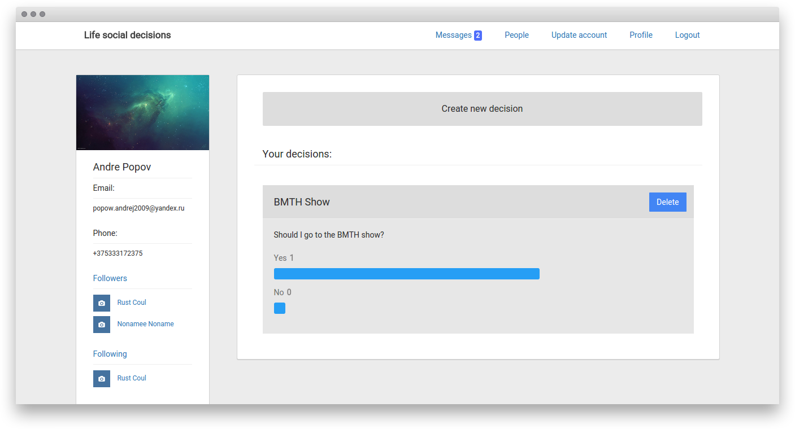
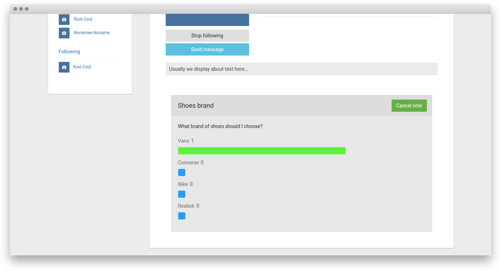
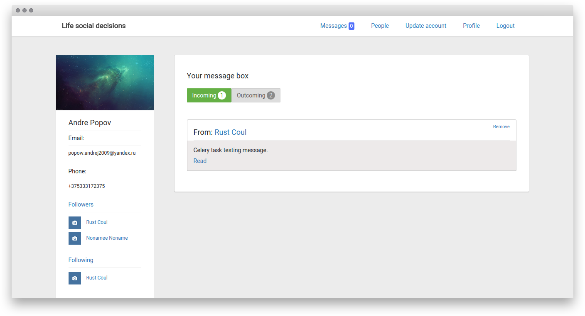
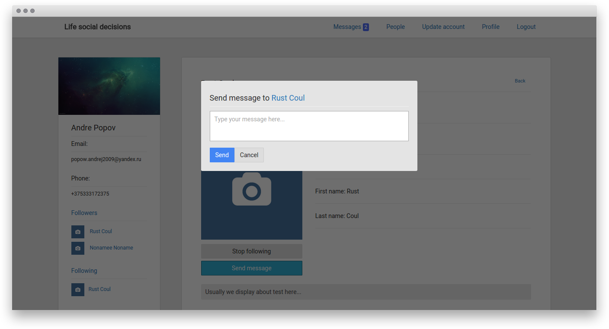
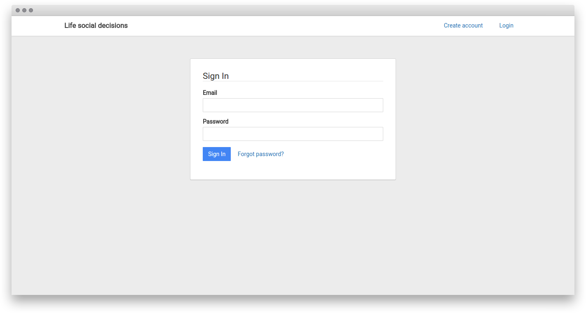

# Social network project

This is a Life Social Decisions, simple social network application which allow users to post some decision to post some decisions while making which they are in doubt and need some kind of advice.

The users of this application may:

+ Sign up and sign in
+ Update their account data
+ Post and remove decisions
+ Vote on other user's decision
+ Follow and stop following other users
+ Send messages to other users
+ Read and remove messages from thier message box

This application is created using ***Python*** programming language and its web framework ***Django***. When user logs in, he or she gets an email. Email is also sent when the user gets some message. Emails are sent in asyncronous manner using ***Celery*** tasks.

Following, message sending, voting work without page reloading, as a client side application which interact with backend using its API. Client side code is written in ***JavaScript*** and frontend library ***ReactJS*** using ***Flux*** architecture. ***Gulp*** is used for compiling ***ES6*** and ***Stylus*** files. I've produced API using ***Django Rest Framework***.

It order to make forms look in a modern way I've used ***Django Bootstrap Form*** package. Design is generally based on [Bootstrap Google Plus](https://github.com/iatek/bootstrap-google-plus) theme.

I've chosen ***MySQL*** as a database for this application.